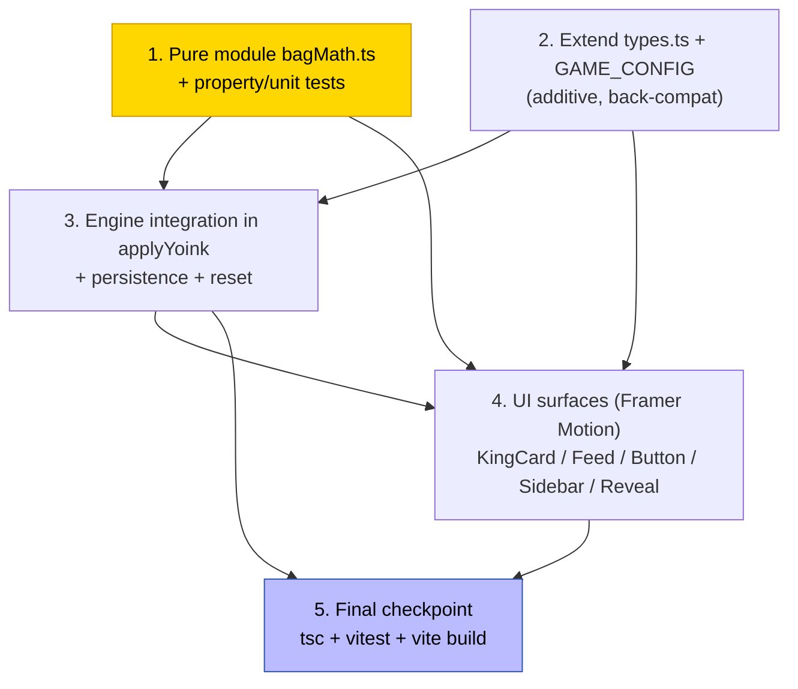

# Implementation Plan: Reign Toll ("The Bag")

## Overview

This plan builds **Reign Toll** for *The Bag* the same way the Siege economy was built: **pure core first**, then engine integration, then UI, with the app compiling and runnable at every step. The strategy:

1. Land the pure, side-effect-free money module `src/lib/bagMath.ts` (own types, decoupled from `siegeMath.ts`) and lock its behavior with `fast-check` property tests + worked-example unit tests. Nothing else depends on it yet, so the app keeps building.
2. Extend the shared types/config additively (back-compatible optional fields) so existing code keeps compiling.
3. Wire the single settlement seam (`applyYoink` in `useGameState.ts`) to use the pure module, persist tolls, and reset per round — verified with an engine integration test.
4. Layer the Framer-Motion-only UI on the now-populated state (KingCard, ActivityFeed, YoinkButton, StatsSidebar, WinReveal), respecting `useReducedMotion`.
5. Final checkpoint: typecheck, tests, and production build all green; confirm no Siege files touched and no dependencies added.

Implementation language: **TypeScript** (matches the existing React 19 / Vite 6 codebase). No new packages; Framer Motion 12 + fast-check 4.8 + vitest 4.1 are already present.

Tasks marked with `*` are optional test sub-tasks and may be skipped for a faster MVP; all non-`*` tasks are required.

## Task Dependency Graph



**Critical path:** 1 → 3 → 4 → 5. Task 2 is a small additive prerequisite shared by 3 and 4 and can be done immediately after (or in parallel with) Task 1.

## Tasks

- [x] 1. Create the pure money module `src/lib/bagMath.ts`
  - Create `src/lib/bagMath.ts` defining its **own** types — `BagTierId` (`"pit" | "grind" | "arena" | "court"`), `BagSplitParams`, `YoinkSplit`, `YoinkDeltas` — and do **not** import `TierParams`/`TIER_PARAMS` from `siegeMath.ts` (separate source of truth).
  - Define `TOLL_BPS_BY_ROOM` (pit 400, grind 600, arena 700, court 800) and derive `bagBps = 8300 − tollBps`; fix `rakeBps = 1000`, `jackpotBps = 500`, `drainBps = 200` for every tier.
  - Implement `bagSplitParamsFor(roomId)` (valid id → that tier's params; five bps fields sum to 10000), with an **arena fallback** for any unknown/invalid room id.
  - Implement `tollFor`, `bagAddFor`, `splitYoinkFee`, `settleYoink`, `evHousePerYoink`, `collusionFloor`, `playerSideBps` as pure/total/side-effect-free functions (no time, randomness, storage, or DOM).
  - Clamp `fee < 0` or non-finite `fee` (NaN/Infinity) so all split parts are 0; round monetary outputs to 6 decimal places (consistent with `bagAddFor`) so dust never accumulates; cap `toToll` at `fee`.
  - Export `export const BAG_ESCROW_LIVE = false;`.
  - _Requirements: 1.1, 1.4, 1.5, 2.1, 2.2, 2.4, 2.5, 3.1, 3.4, 4.1, 4.4, 5.1, 5.2, 6.1, 6.3, 9.1, 17.1, 17.2, 18.1, 19.1, 19.2, 19.3_

  - [x]* 1.1 Write fast-check property tests for `bagMath` (dev-only, mirror Siege)
    - Create `src/lib/bagMath.test.ts`; run via `vitest run`; tag each test `Feature: bag-reign-toll, Property N: ...`; configure `numRuns >= 100`; generate `fee >= 0` across all four tiers.
    - **Property 1 (Conservation):** for any `fee >= 0` and tier, `toBag+toToll+toRake+toJackpot+toDrain === fee` to lamport precision (1e-9). _Validates: Requirements 1.2, 1.3_
    - **Property 2 (Toll exact fraction):** `tollFor(fee) === fee · tollBps/10000` and `0 <= tollFor(fee) <= fee`. _Validates: Requirements 2.2, 2.3_
    - **Property 3 (Player-side invariant):** `toBag + toToll === 0.83 · fee` for every tier (and `=== 0` when `fee === 0`). _Validates: Requirements 3.2, 3.3, 3.4_
    - **Property 4 (House-side preserved):** `toRake+toJackpot+toDrain === 0.17 · fee`, `toRake === 0.10 · fee`, `toJackpot === 0.05 · fee`, independent of toll rate. _Validates: Requirements 4.2, 4.3, 4.4_
    - **Property 5 (Monotonic toll by tier):** `τ(pit) < τ(grind) < τ(arena) < τ(court)` and `bagBps(tier) > 0` for all tiers. _Validates: Requirements 5.3, 5.4, 5.5_
    - **Property 6 (Zero-sum settlement):** `settleYoink` deltas satisfy `payer+outgoingKing+bag+house+jackpot === 0`. _Validates: Requirements 6.2, 6.3_
    - **Property 7 (Collusion −EV):** model-based — for any random sequence of yoinks within a closed group, group net `<= −0.12 · ΣF < 0` when `ΣF > 0`. _Validates: Requirements 9.1, 9.2_
    - **Property 8 (Free yoink banks nothing):** `fee === 0 ⇒ toToll === 0 ∧ toBag === 0` for every tier. _Validates: Requirements 8.1_
    - **Property 9 (Non-negativity):** every part of `YoinkSplit` is `>= 0` for any `fee >= 0`. _Validates: Requirements 1.3_

  - [x]* 1.2 Write worked-example unit tests for `bagMath`
    - Lamport-exact Arena `F = 0.20 SOL` split reproduces the design table (Bag 152,000,000; Toll 14,000,000; Rake 20,000,000; Jackpot 10,000,000; Drain 4,000,000).
    - Busy Arena (Example A) and quiet Grind (Example B) toll-pool and bag-inflow totals match the design.
    - `fee = 0` → all parts 0; unknown room id → arena fallback; each tier's five bps fields sum to 10000.
    - _Requirements: 2.2, 3.3, 5.3, 8.1, 19.2_

- [x] 2. Extend shared types and game config (additive, back-compatible)
  - In `src/lib/types.ts`: add optional `tollsBanked?: number` to `King`, optional `tollPaid?: number` to `YoinkEvent`, and required `roundTollsBanked: number` to `GameState`.
  - Add `TOLL_BPS_BY_ROOM` to `GAME_CONFIG` (pit 400, grind 600, arena 700, court 800), reusing/aligning with the `bagMath` constant.
  - Keep every change additive so existing code and seeded `King` objects still compile (absent `tollsBanked`/`tollPaid` treated as 0 by consumers).
  - _Requirements: 5.2, 7.3, 7.5, 10.5, 19.4, 19.5, 19.6_

- [x] 3. Integrate Reign Toll into the engine settlement seam (`src/hooks/useGameState.ts`)
  - [x] 3.1 Wire `applyYoink` to use `splitYoinkFee` / `bagSplitParamsFor`
    - Compute `params = bagSplitParamsFor(roomId)` and `split = splitYoinkFee(cost, params)` in `applyYoink`.
    - Credit the outgoing King (`prev.currentKing`) `split.toToll`, banked instantly and kept regardless of the fuse outcome; add **only** `split.toBag` to the bag (drain mechanic unchanged).
    - Set the dethroned King's `King.tollsBanked` to its accumulated round total (previous banked tolls + this yoink's toll); record `YoinkEvent.tollPaid === cost · tollBps/10000`.
    - When the dethroned King is the local player, add the toll to `GameState.roundTollsBanked`.
    - Preserve the existing self-yoink early-return guard; leave `jackpot.ts` and `payouts.ts` calls unchanged except for the rebalanced bag share; keep settlement applied to local React state (`BAG_ESCROW_LIVE` is `false`).
    - Free yoink (`cost === 0`) forces `toll = 0` (banks nothing) end-to-end.
    - _Requirements: 7.1, 7.2, 7.3, 7.4, 7.5, 7.6, 7.7, 8.2, 8.3, 9.3, 9.4, 18.2_

  - [x] 3.2 Reset round tolls and persist lifetime tolls
    - Reset `roundTollsBanked` to 0 in `makeInitial` and `playAgain`.
    - Persist the updated lifetime tolls total to `localStorage` key `yoink_tolls_v1` on dethrone (and on unmount), and read it on mount, all wrapped in try/catch (mirroring `jackpot.ts`); fall back to in-memory for the session if `localStorage` is unavailable.
    - _Requirements: 10.1, 10.2, 10.3, 10.4, 10.5_

  - [x]* 3.3 Write engine integration tests for toll settlement
    - **Property 10 (Round toll accumulation conserved):** the local player's `roundTollsBanked` equals the sum of `tollPaid` over every `YoinkEvent` that dethroned them that round. _Validates: Requirement 11.1_
    - Zero-sum across a full dethrone (payer −fee, outgoing King +toll, bag +toBag, house/jackpot unchanged).
    - Free yoink (`cost === 0`) banks nothing end-to-end (`tollsBanked`/`roundTollsBanked`/`tollPaid` all unaffected).
    - _Requirements: 7.1, 7.6, 8.2, 8.3, 11.1_

- [x] 4. Build the Reign Toll UI surfaces (Framer Motion only, respect `useReducedMotion`)
  - [x] 4.1 KingCard live tolls ticker + value prop + dethrone fly-up
    - While the local player holds the throne, render a gold "Tolls banked · {roundTollsBanked} SOL" chip with a Framer Motion spring count-up + scale pop on increment; show the value prop "Hold the throne · bank tolls".
    - On dethrone, animate a "+{toll} SOL" gold token rising and fading from the throne avatar; under reduced motion, swap the count-up/fly-up for an instant value change or a static badge.
    - _Requirements: 12.1, 12.2, 12.3, 12.4, 12.5_

  - [x] 4.2 ActivityFeed toll line
    - For each `YoinkEvent` with `tollPaid > 0`, always render a gold secondary line "↳ +{tollPaid} SOL toll → {prevKing}" (takes precedence over omission); omit the line when `tollPaid === 0`.
    - _Requirements: 13.1, 13.2_

  - [x] 4.3 YoinkButton sublabels
    - When not King, add the sublabel variant "Take the throne — then bank a toll every time they take it back."; when King, append "· banking tolls" to the existing label. No change to cost/heat logic.
    - _Requirements: 14.1, 14.2_

  - [x] 4.4 StatsSidebar round + lifetime Reign Tolls
    - Add a "Reign Tolls" stat showing this round's `roundTollsBanked` and the lifetime total from `localStorage`; animate the lifetime total upward (Framer Motion) when a new toll is banked.
    - _Requirements: 15.1, 15.2_

  - [x] 4.5 WinReveal pot vs reign-tolls separation
    - At round end, render the pot payout and reign tolls as distinct lines with a combined total ("Pot: X SOL · Reign tolls: Y SOL · Total: X+Y").
    - _Requirements: 16.1_

  - [x]* 4.6 Write a lightweight KingCard rendering test
    - Verify the tolls chip renders when `roundTollsBanked > 0` and that `useReducedMotion` swaps the count-up for a static value (example-based RTL check, not a property test).
    - _Requirements: 12.1, 12.5_

- [x] 5. Final checkpoint — verify build, types, tests, and scope
  - Run `tsc` (typecheck) clean, `vitest run` green (all property + unit + integration tests), and `vite build` succeeds.
  - Confirm no Siege files were touched (`siegeMath.ts`, `walletWarsState.ts`, all `walletwars/*`) and no dependencies were added/upgraded (`package.json` / lockfile unchanged); confirm `BAG_ESCROW_LIVE` is still `false`.
  - Ensure all tests pass, ask the user if questions arise.
  - _Requirements: 17.2, 18.1, 18.2_

## Notes

- Tasks marked with `*` are optional test sub-tasks and can be skipped for a faster MVP; core implementation tasks (1, 2, 3.1, 3.2, 4.1–4.5, 5) are required.
- Each task references specific requirement sub-clauses for traceability; property-test sub-tasks additionally cite the design Correctness Property they validate.
- Pure-core-first ordering keeps the app compiling and runnable at every step: `bagMath.ts` lands with no consumers, types are additive, then the engine and UI consume them.
- Out of scope (not in any task): on-chain/Solana/VRF settlement, Wallet Wars / Siege changes, and the optional fee-bump (`BAG_FEE_BUMP_BPS`) and diminishing-toll levers.
```
