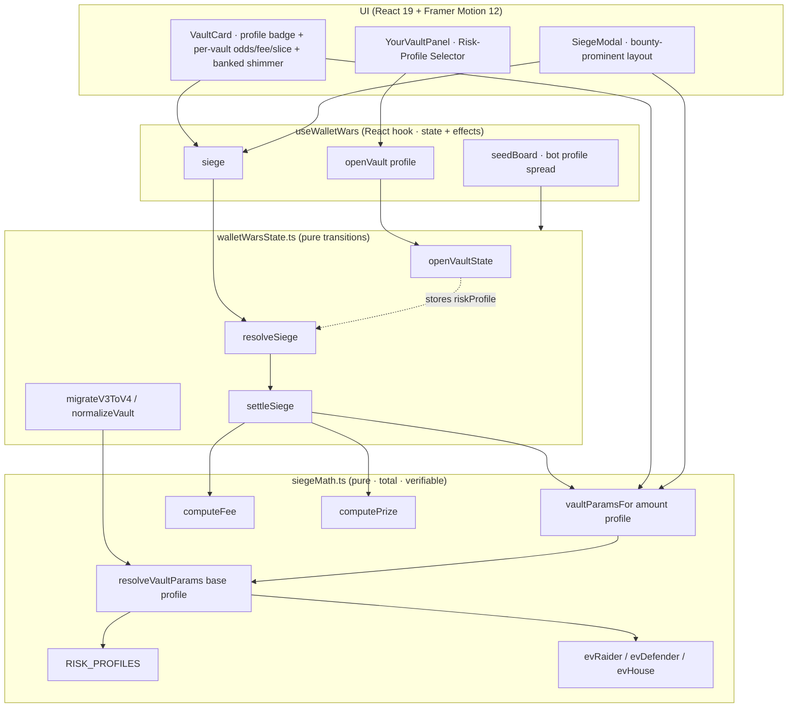
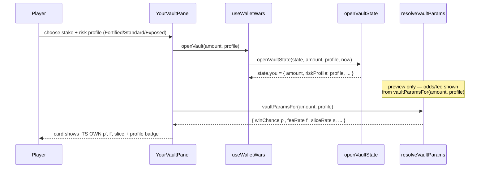
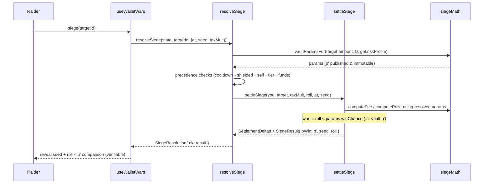

# Design Document: Variable-Risk Vaults

## Overview

Variable-Risk Vaults extends the existing Wallet Wars "Siege the Vault" economy by letting a
player pick a **risk profile** — **Fortified**, **Standard**, or **Exposed** — at the moment they
open a vault. The chosen profile is **published on the vault and locked for its entire lifetime**;
it can never change. Each profile shifts the vault's crack odds `p` and attempt fee `f` (the slice
rate `s` and both house rakes stay fixed) so that the **defender's expected value is held constant
across all three profiles within a tier**, while the **variance differs sharply**: Fortified vaults
survive longer and bank small steady tolls; Exposed vaults get cracked far more often but collect a
much bigger toll per survived siege.

The critical design constraint is that this must **not** weaken provable fairness. The win check
stays exactly `win ⇔ rollFromSeed(seed) < p_vault`, where `p_vault` is the vault's published,
immutable crack chance — so anyone can still recompute and verify any siege from its revealed seed.
Odds are **never** auto-varied by streak, heat, age, or balance; the only thing the profile does is
choose a *published, fixed* `p` (and the `f` derived from it) at open time. This preserves the
existing fairness invariant and every existing correctness property (conservation / zero-sum, EV
signs, collusion is −EV).

Implementation mirrors the proven pattern already in the codebase: the pure siege functions
(`computeFee`, `computePrize`, `settleFailure`, `settleSuccess`) already **take `TierParams`**, so
the change is mostly plumbing. We add a `riskProfile` field to `Vault`, a pure
`resolveVaultParams(base, profile)` helper in `siegeMath.ts` that adjusts the base `TierParams`, and
route every settlement through it. `siegeMath` stays pure/total. Existing vaults and legacy
(`v4`/`v3`) saves without the field migrate to `Standard`, which is the algebraic identity of the
resolver — so migrated vaults behave bit-for-bit as they do today.

This design also folds in three UI-polish refinements from product feedback: trim the vault card to
~5 primary fields plus a profile badge, replace the "0.00 banked everywhere" dead look with real
accumulated banked (+ a subtle accumulation shimmer), and give bounties top-of-modal prominence.

**In scope:** the profile model + pure param resolution, `Vault`/state/migration changes, bot
profile spread, and the three UI refinements (profile selector, per-vault odds/fee/slice card
redesign, banked display, bounty prominence). **Out of scope (unchanged):** The Bag /
bag-reign-toll, real Solana escrow/VRF (`ESCROW_ENABLED` stays `false`), and any hidden/auto-varying
odds.

---

## Architecture



**Key idea:** the profile resolves to a `TierParams` *once*, at the point of any economic
calculation, via `vaultParamsFor(vault.amount, vault.riskProfile)`. Everything downstream
(`computeFee`, `computePrize`, settlement, EV, the UI displays) consumes that resolved params object
unchanged. No new arithmetic is introduced into the engine.

---

## Sequence Diagrams

### Opening a vault with a chosen profile



### Sieging a profiled vault (fairness path preserved)



---

## Components and Interfaces

### siegeMath.ts (additions — pure & total)

**Purpose:** define the three risk profiles and the pure function that maps a base `TierParams` +
profile to the *effective* `TierParams`, holding defender EV constant by construction.

```typescript
/** The three published risk profiles, locked per-vault for its lifetime. */
export type RiskProfile = "fortified" | "standard" | "exposed";

export interface RiskProfileSpec {
  id: RiskProfile;
  label: string;            // "Fortified" | "Standard" | "Exposed"
  /** κ — multiplier applied to the tier's base crack odds p. */
  oddsFactor: number;       // fortified 0.6 · standard 1.0 · exposed 1.5
  blurb: string;            // UI framing copy: low risk/low reward → high risk/high reward
}

export const RISK_PROFILES: Record<RiskProfile, RiskProfileSpec>;
export const RISK_PROFILE_ORDER: readonly RiskProfile[]; // ["fortified","standard","exposed"]
export const DEFAULT_RISK_PROFILE: RiskProfile;          // "standard" (migration target)

/** True iff `x` is a valid RiskProfile (used by migration/normalisation). */
export function isRiskProfile(x: unknown): x is RiskProfile;

/**
 * Resolve the EFFECTIVE TierParams for a base tier + risk profile.
 * Adjusts only winChance (p) and feeRate (f); sliceRate and both rakes are unchanged.
 * Holds defender EV constant: f' is derived from the chosen p' so that
 *   evDefender(resolved) === evDefender(base)   (to floating-point tolerance).
 * Standard (κ = 1) is the exact identity of `base` — guarantees migration safety.
 * Total: p' is clamped to (0,1); base must be a well-formed TierParams.
 */
export function resolveVaultParams(base: TierParams, profile: RiskProfile): TierParams;

/** Convenience: tier-from-amount, then profile resolution. */
export function vaultParamsFor(amount: number, profile: RiskProfile): TierParams;
```

**Responsibilities**
- Own the single source of truth for the profile knob (`oddsFactor`).
- Convert a profile into effective economic params with the defender-EV-preserving formula.
- Remain pure, total, and verifiable (the on-chain re-implementation honours the same arithmetic).

### walletWarsState.ts (changes)

**Purpose:** carry the immutable `riskProfile` on every vault, default/migrate it to `Standard`,
spread bot profiles, and resolve params through the profile in settlement.

```typescript
export interface Vault {
  // ...all existing fields unchanged...
  /** Published, IMMUTABLE risk profile chosen at open time. Never mutated after creation. */
  riskProfile: RiskProfile;
}

/** Open the player's vault with a chosen profile (defaults to Standard). */
export function openVaultState(
  state: WarState, amount: number, profile: RiskProfile, at: number,
): WarState;
```

**Responsibilities**
- `settleSiege` resolves params via `vaultParamsFor(defender.amount, defender.riskProfile)` instead
  of `tierParamsFor(defender.amount)` — the only call-site change in the settlement core.
- `settleSiege` preserves `riskProfile` on the returned defender vault (never rewrites it).
- `makeBotVault` assigns a profile from a weighted spread so the board shows variety.
- `normalizeVault`, `migrateV3ToV4`, and the v4 loader default a missing/invalid `riskProfile` to
  `Standard`.
- `verifySiege` is unchanged in signature; the engine passes the vault's published `p'` as `pWin`.

### UI components

| Component | Change |
|---|---|
| `YourVaultPanel` (open flow) | Add a 3-way **risk-profile selector** with low→high framing; passes the chosen profile to `openVault`. |
| `VaultCard` | Trim to ~5 primary fields (vault size · ITS crack odds · fee you risk · slice you win · siege button) + a **profile badge** (FORTIFIED / STANDARD / EXPOSED). Streak/banked move to a secondary tap/expand row. Odds/fee/slice come from `vaultParamsFor(vault.amount, vault.riskProfile)`. |
| `VaultCard` (banked) | Show real accumulated banked on bot vaults + a subtle accumulation shimmer (Framer Motion, reduced-motion safe). |
| `SiegeModal` | Promote the bounty block from the bottom to a prominent position near the headline; uses the vault's profile-resolved `p'`, `f'`, slice. |

---

## Data Models

### RiskProfile & RiskProfileSpec

```typescript
type RiskProfile = "fortified" | "standard" | "exposed";

interface RiskProfileSpec {
  id: RiskProfile;
  label: string;
  oddsFactor: number; // κ
  blurb: string;
}
```

**Validation rules**
- `oddsFactor` must yield `p' = base.winChance · κ ∈ (0, 1)` for every tier (verified by the table
  below; the resolver also clamps defensively for totality).
- `RISK_PROFILES.standard.oddsFactor === 1` (identity invariant — must never change).

### Vault (extended)

```typescript
interface Vault {
  // existing fields…
  riskProfile: RiskProfile; // immutable for the vault's lifetime
}
```

**Validation rules**
- Set exactly once at creation (`openVaultState` / `makeBotVault` / migration); never reassigned.
- On load, an absent or non-`RiskProfile` value normalises to `"standard"`.

---

## EV-Balancing Derivation (the real math)

All rates are fractions of the vault corpus `V`; one attempt; streak multiplier `m = 1`. The
existing pure EV formulas (unchanged) are:

```
EV_raider   = p·s·(1 − ρ_prize) − f
EV_defender = (1 − ρ_fee)·f − p·s
EV_house    = ρ_fee·f + p·ρ_prize·s
```

**Zero-sum identity (holds for *any* params).** Summing the three:

```
EV_raider + EV_defender + EV_house
  = [p·s − p·s·ρ_prize − f] + [f − ρ_fee·f − p·s] + [ρ_fee·f + p·ρ_prize·s]
  = 0
```

The `p·s` terms cancel, the `f` terms cancel, the `ρ_fee·f` terms cancel, and
`−p·s·ρ_prize + p·ρ_prize·s = 0`. So the economy is exactly zero-sum (the prize slice leaving the
defender corpus is booked into `EV_defender`). This is the existing conservation property and it is
**parameter-agnostic** — it already holds for whatever params a profile produces.

### The profile knob

A profile chooses a crack-odds multiplier **κ** and sets `p' = p_base · κ`. To hold defender EV
constant we **derive `f'` from `p'`** by solving `EV_defender(p', f') = D`, where
`D = EV_defender(base) = (1 − ρ_fee)·f_base − p_base·s` is the tier's Standard defender EV:

```
(1 − ρ_fee)·f' − p'·s = D
⇒  f' = (D + p'·s) / (1 − ρ_fee)
```

`s`, `ρ_fee`, `ρ_prize` are left at their tier values. Note that **κ = 1 reproduces the base
exactly**: `f' = (D + p_base·s)/(1 − ρ_fee) = ((1 − ρ_fee)·f_base − p_base·s + p_base·s)/(1 − ρ_fee)
= f_base`. So `resolveVaultParams(base, "standard") === base` — the migration-safety identity.

### Why the sign-invariants hold for *every* profile×tier (by construction)

Because defender EV is pinned to `D` and the three EVs sum to zero:

```
EV_raider + EV_house = −D
```

`EV_house = ρ_fee·f' + p'·ρ_prize·s`. With `ρ_fee, ρ_prize, s > 0`, `f' > 0`, `p' > 0`, **every term
is strictly positive ⇒ EV_house > 0 always.** And since `D ≥ 0` (defender EV is non-negative by
design) and `EV_house > 0`:

```
EV_raider = −D − EV_house < 0   (strictly negative, always)
```

So **as long as a profile holds defender EV at the tier's `D ≥ 0` via the `f'` derivation, the
raider EV is automatically strictly negative and the house EV automatically strictly positive — for
all profiles and all tiers.** No per-combo tuning is required; the invariant is structural. This is
the central safety result of the design.

### Variance contrast

The defender banks the toll on *every* outcome and additionally loses the slice `s` only on a crack
(prob `p'`). So the single-attempt defender payoff is `toll` w.p. `(1−p')` and `toll − s` w.p. `p'`,
with mean `D` and:

```
Var_defender = s² · p'·(1 − p')
```

With `s` fixed and all `p' < 0.5`, variance is strictly increasing in `p'`, so
`Var_fortified < Var_standard < Var_exposed` within every tier. Combined with the bigger toll
(`toll = (1−ρ_fee)·f'`, also larger for Exposed) and the shorter expected lifetime
(`E[sieges to first crack] = 1/p'`), Fortified = "grind small steady tolls over a long life",
Exposed = "collect a big toll, get cracked fast". Same defender EV, sharply different ride.

### Per-tier, per-profile EV table

Profiles: **κ = 0.6 (Fortified) · 1.0 (Standard) · 1.5 (Exposed)**. Values are fractions of `V` per
attempt (`m = 1`). `f'` rounded to 5 dp; EV/variance to ~6 dp. Standard rows equal today's published
values exactly.

| Tier | Profile | p' | f' | s | EV_raider | EV_defender | EV_house | Var_def (×s²) |
|---|---|---|---|---|---|---|---|---|
| **Pit** (ρf 0.01, ρp 0.02, D=0.0018) | Fortified | 0.072 | 0.01273 | 0.15 | −0.002143 | 0.001800 | 0.000343 | 0.066816 |
| | Standard | 0.120 | 0.02000 | 0.15 | −0.002360 | 0.001800 | 0.000560 | 0.105600 |
| | Exposed | 0.180 | 0.02909 | 0.15 | −0.002631 | 0.001800 | 0.000831 | 0.147600 |
| **Grind** (ρf 0.06, ρp 0.08, D=0.0011) | Fortified | 0.060 | 0.00947 | 0.13 | −0.002292 | 0.001100 | 0.001192 | 0.056400 |
| | Standard | 0.100 | 0.01500 | 0.13 | −0.003040 | 0.001100 | 0.001940 | 0.090000 |
| | Exposed | 0.150 | 0.02191 | 0.13 | −0.003975 | 0.001100 | 0.002875 | 0.127500 |
| **Arena** (ρf 0.12, ρp 0.15, D=0.0000) | Fortified | 0.048 | 0.00600 | 0.11 | −0.001512 | 0.000000 | 0.001512 | 0.045696 |
| | Standard | 0.080 | 0.01000 | 0.11 | −0.002520 | 0.000000 | 0.002520 | 0.073600 |
| | Exposed | 0.120 | 0.01500 | 0.11 | −0.003780 | 0.000000 | 0.003780 | 0.105600 |
| **Court** (ρf 0.15, ρp 0.18, D=0.0014) | Fortified | 0.036 | 0.00546 | 0.09 | −0.002802 | 0.001400 | 0.001402 | 0.034704 |
| | Standard | 0.060 | 0.00800 | 0.09 | −0.003572 | 0.001400 | 0.002172 | 0.056400 |
| | Exposed | 0.090 | 0.01177 | 0.09 | −0.004534 | 0.001400 | 0.003134 | 0.081900 |

**Reading the table**
- **EV_raider < 0** in all 12 combos (slightly negative, the intended "house edge" feel).
- **EV_defender** is *identical across the three profiles within each tier* (0.0018 Pit, 0.0011
  Grind, 0.0000 Arena break-even, 0.0014 Court) — no profile is a trap or a free lunch.
- **EV_house > 0** in all 12 combos.
- **Var_def** (shown as the `p'(1−p')` factor; multiply by `s²` for the absolute number) increases
  monotonically Fortified → Standard → Exposed in every tier — the sharp variance spread the feature
  promises.
- Each column satisfies `EV_raider + EV_defender + EV_house = 0` (zero-sum) to floating-point
  tolerance.

---

## Key Functions with Formal Specifications

### resolveVaultParams(base, profile)

```typescript
function resolveVaultParams(base: TierParams, profile: RiskProfile): TierParams
```

**Preconditions**
- `base` is a well-formed `TierParams` (`0 < winChance < 1`, `feeRate ≥ 0`, `0 ≤ sliceRate ≤ 1`,
  `0 ≤ houseFeeCut < 1`, `0 ≤ housePrizeRake < 1`).
- `profile ∈ {"fortified","standard","exposed"}`.

**Postconditions**
- Returns a `TierParams` with the same `id`, `sliceRate`, `houseFeeCut`, `housePrizeRake` as `base`.
- `result.winChance = clamp(base.winChance · κ, ε, 1−ε)` where `κ = RISK_PROFILES[profile].oddsFactor`.
- `result.feeRate = (evDefender(base) + result.winChance · base.sliceRate) / (1 − base.houseFeeCut)`.
- `evDefender(result) ≈ evDefender(base)` (within `1e-9`) whenever no clamp was applied.
- `profile === "standard" ⇒ result` deep-equals `base`.
- Pure, total, no side effects.

**Loop invariants:** N/A (no loops).

### vaultParamsFor(amount, profile)

```typescript
function vaultParamsFor(amount: number, profile: RiskProfile): TierParams
```

**Preconditions:** `amount ≥ 0`; `profile` is a valid `RiskProfile`.
**Postconditions:** `= resolveVaultParams(tierParamsFor(amount), profile)`. Total for all
`amount ≥ 0`. **Loop invariants:** N/A.

### openVaultState(state, amount, profile, at)

```typescript
function openVaultState(state: WarState, amount: number, profile: RiskProfile, at: number): WarState
```

**Preconditions:** `amount ≥ 0`; `profile` valid; `at` a finite epoch ms.
**Postconditions:** if `state.you` exists, returns `state` unchanged; otherwise returns a state whose
`you` vault has `riskProfile === profile` and all existing fields set as today. No mutation of input.
**Loop invariants:** N/A.

### settleSiege (modified)

**Preconditions:** raider and defender are well-formed vaults; `roll ∈ [0,1)`; `taxMult ≥ 0`.
**Postconditions:** uses `params = vaultParamsFor(defender.amount, defender.riskProfile)`;
`won = roll < params.winChance`; per-actor deltas come solely from `computeFee`/`computePrize` on
`params`; `raider + defender + house + corpus === 0`; returned defender preserves `riskProfile`.
**Loop invariants:** N/A.

---

## Algorithmic Pseudocode

```pascal
ALGORITHM resolveVaultParams(base, profile)
INPUT:  base TierParams, profile RiskProfile
OUTPUT: effective TierParams (defender-EV-preserving)
BEGIN
  kappa <- RISK_PROFILES[profile].oddsFactor
  IF kappa = 1 THEN
    RETURN base                                   // Standard is the exact identity
  END IF
  D  <- (1 - base.houseFeeCut) * base.feeRate - base.winChance * base.sliceRate   // evDefender(base)
  p2 <- clamp(base.winChance * kappa, EPS, 1 - EPS)
  f2 <- (D + p2 * base.sliceRate) / (1 - base.houseFeeCut)                        // hold D constant
  RETURN { id: base.id, winChance: p2, feeRate: f2,
           sliceRate: base.sliceRate,
           houseFeeCut: base.houseFeeCut, housePrizeRake: base.housePrizeRake }
END

ALGORITHM settleSiege(raider, defender, taxMult, roll, at, seed)   // modified line only
BEGIN
  params <- vaultParamsFor(defender.amount, defender.riskProfile)   // was tierParamsFor(amount)
  mult   <- feeMultiplierForStreak(defender.streak, STREAK_CFG)
  feeB   <- computeFee(defender.amount, params, mult, taxMult)
  won    <- roll < params.winChance                                 // == published vault p'
  ... (unchanged settlement; defender.riskProfile carried through) ...
END
```

---

## Example Usage

```typescript
// Open an Exposed vault in the Pit
const opened = openVaultState(state, 0.5, "exposed", Date.now());
// opened.you.riskProfile === "exposed"

// What the card shows for THIS vault (not a flat tier number)
const p = vaultParamsFor(opened.you!.amount, opened.you!.riskProfile);
// p.winChance ≈ 0.18 (vs Standard 0.12), p.feeRate ≈ 0.0291

// Verifiable result after a siege — win check uses the vault's published p'
const ok = verifySiege(result.seed, result.pWin, result.outcome);
// result.pWin === p.winChance (the immutable, published crack chance)

// Migration safety: legacy vault without a profile loads as Standard (identity)
resolveVaultParams(PIT_PARAMS, "standard"); // deep-equals PIT_PARAMS
```

---

## UI Plan

### 1. Risk-profile selector (open flow, `YourVaultPanel`)

- A 3-segment control: **Fortified → Standard → Exposed**, rendered left-to-right as an explicit
  "low risk / low reward → high risk / high reward" gradient.
- Each segment previews ITS effect for the chosen stake using `vaultParamsFor(amount, profile)`:
  crack odds `p'`, fee you'll bank per failed siege, and the "survive longer vs. cracked more"
  framing from `RISK_PROFILES[profile].blurb`.
- Selecting a segment animates with Framer Motion (`layout`/transform-opacity only); honours
  `prefers-reduced-motion` via the shared `usePrefersReducedMotion` hook. Default selection =
  `Standard`.
- On confirm, calls `openVault(amount, profile)`.

### 2. VaultCard redesign (~5 primary fields + profile badge)

Primary (always visible):
1. **Vault size** (corpus `V`).
2. **ITS crack odds** `p'` — from `vaultParamsFor`, the vault's own published value (not a flat tier
   number).
3. **Fee you risk** `f'` — its own per-vault fee.
4. **Slice you win** — its own prize slice.
5. **Siege button.**

Plus a **profile badge** (`FORTIFIED` / `STANDARD` / `EXPOSED`) with profile-specific accent.
Secondary fields (**streak, banked, survived/cracked**) collapse into a tap/expand row to reduce
clutter.

### 3. Banked display — kill the "0.00 everywhere" dead look

- Seed bot vaults with realistic accumulated `banked` (already partially done in `makeBotVault`;
  ensure it reads as alive across the board).
- Add a subtle **accumulation shimmer** on the banked figure (Framer Motion opacity/transform pulse)
  so the fee mechanic looks live. Shimmer is disabled under `prefers-reduced-motion`.

### 4. Bounty prominence (`SiegeModal`)

- Move the bounty block from the bottom of the modal to a **prominent position near the headline**
  (directly under the target/value-prop block), framed as a top viral/shareable mechanic.
- Keep using the typed `onPlaceBounty` flow and the v2 escrow safety; no economic change.

All animations: **Framer Motion only**, transform/opacity, `willChange: transform`, and
reduced-motion respected.

---

## Correctness Properties

*A property is a characteristic that should hold across all valid executions — the bridge between
the human-readable spec and machine-verifiable guarantees. These extend the existing Siege economy
properties to all three risk profiles. Requirement references are added during the requirements
phase.*

### Property 1: Standard profile is the identity (migration safety)

*For all* well-formed `TierParams` `base`, `resolveVaultParams(base, "standard")` deep-equals `base`.

### Property 2: Defender EV is preserved across profiles

*For all* tiers and *for all* profiles, `evDefender(resolveVaultParams(base, profile))` equals
`evDefender(base)` within a `1e-9` tolerance (when no odds clamp is applied).

### Property 3: Raider EV is strictly negative for every profile×tier

*For all* tiers and *for all* profiles, `evRaider(vaultParamsFor(amount, profile)) < 0`.

### Property 4: House EV is strictly positive for every profile×tier

*For all* tiers and *for all* profiles, `evHouse(vaultParamsFor(amount, profile)) > 0`.

### Property 5: Zero-sum conservation holds for every profile×tier

*For all* profiles, tiers, corpora, streak multipliers, and rolls, a settled siege satisfies
`raider + defender + house + corpus === 0` (to floating-point tolerance).

### Property 6: Provable fairness with the published per-vault odds

*For all* vaults and *for all* seeds, the settled outcome is `win ⇔ rollFromSeed(seed) < p_vault`,
where `p_vault = vaultParamsFor(vault.amount, vault.riskProfile).winChance`, and
`verifySiege(seed, p_vault, outcome)` returns `true`.

### Property 7: Risk profile is immutable across the vault lifetime

*For all* sequences of sieges/settlements/compounding applied to a vault, the vault's `riskProfile`
is unchanged from the value set at creation.

### Property 8: Variance ordering matches the profiles

*For all* tiers, the defender single-attempt variance `s²·p'(1−p')` is strictly ordered
`Fortified < Standard < Exposed`.

### Property 9: Effective odds are a valid probability

*For all* well-formed `base` and *for all* profiles, `0 < resolveVaultParams(base, profile).winChance
< 1` and `feeRate > 0` (totality / well-formedness).

### Property 10: Migration & normalisation default to Standard

*For all* persisted vault records lacking a valid `riskProfile`, loading (via `normalizeVault` /
`migrateV3ToV4`) yields `riskProfile === "standard"`, and the loaded vault's economics are identical
to today's.

---

## Error Handling

| Scenario | Condition | Response | Recovery |
|---|---|---|---|
| Invalid/absent profile on load | Persisted vault has no/garbage `riskProfile` | Normalise to `"standard"` | Vault behaves exactly as today |
| Odds out of range | A (hypothetical) `base·κ` ≥ 1 or ≤ 0 | `resolveVaultParams` clamps `p'` to `(ε, 1−ε)` | Stays a valid probability; total function |
| Profile passed to a closed-vault open | `state.you` already set | Return state unchanged (existing guard) | No duplicate vault |
| Siege declined | Existing precedence (cooldown→shielded→self→tier→funds) | Unchanged typed `SiegeRejection` | UI surfaces the reason; modal stays open |

No new silent-failure surfaces are introduced; the profile is data on the vault, not a new control
path.

---

## Testing Strategy

### Unit testing approach
- `resolveVaultParams` identity for Standard (deep-equal to base) for all four tiers.
- Spot-check the EV table: assert the exact `p'`/`f'`/EV values per profile×tier (12 combos) against
  the published table within tolerance.
- `openVaultState` sets and never overwrites `riskProfile`; bot vaults span all three profiles.
- Migration: a v3/v4 record without `riskProfile` → `"standard"`; economics unchanged.

### Property-based testing approach (fast-check)
- Generate arbitrary well-formed `TierParams` and arbitrary profiles to exercise Properties 1–4, 8,
  9 directly on the pure math.
- Generate arbitrary vaults (amount, streak, profile), seeds, and tax multipliers to exercise
  Properties 5–7 through `settleSiege`/`resolveSiege` (conservation, fairness, immutability).
- Minimum **100 iterations** per property; each test tagged
  `Feature: variable-risk-vaults, Property N: <text>`.
- **Library:** `fast-check` (matches the existing siege economy tests).

### Integration testing approach
- A short end-to-end pure-engine test: open a vault per profile, run a scripted sequence of sieges
  with fixed seeds, and assert the house treasury rises, raider net is ≤ 0 in expectation, and the
  board renders each profile's own odds/fee/slice.

## Performance Considerations
`resolveVaultParams` is O(1) arithmetic with no allocation beyond a small object; safe to call per
card render and per settlement. No new timers; UI shimmer reuses the existing 250 ms card clock.

## Security Considerations
Fairness is preserved: odds are fixed & published per-vault and verifiable from the seed; the profile
cannot be changed after open, so it cannot be used to retro-actively shift odds. `ESCROW_ENABLED`
stays `false` (simulation only). Collusion remains −EV because raider EV is strictly negative for
every profile×tier.

## Dependencies
None added. Uses existing `siegeMath.ts`, `walletWarsState.ts`, React 19, Framer Motion 12,
`fast-check` (already a dev dependency for the siege economy property tests). No dependency upgrades.
