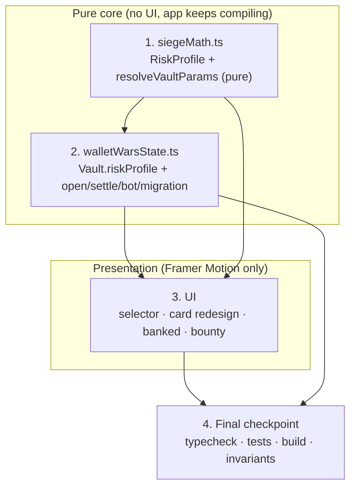

# Implementation Plan: Variable-Risk Vaults

## Overview

This plan extends the existing Wallet Wars "Siege the Vault" economy with per-vault risk profiles,
mirroring the proven pure-core-first build pattern already used for the Siege/Bag economy. We start
in the pure, total `siegeMath.ts` module (profile model + `resolveVaultParams`), then thread the
immutable `riskProfile` through `walletWarsState.ts` (open/settle/bot/migration), and only then wire
the UI (Framer Motion only). The app stays compiling and the existing test suite stays green at every
step: `openVault` gains a profile argument that defaults to `"standard"` so existing call-sites keep
working until the UI is wired.

**Hard constraints honoured throughout:** app-logic + Framer Motion only, no dependency upgrades,
`ESCROW_ENABLED` stays `false`, provable fairness preserved (`win ⇔ rollFromSeed(seed) < p_vault`),
and **The Bag / bag-reign-toll economy is never touched**. Out of scope: real Solana escrow/VRF,
The Bag changes, and any hidden/auto-varying odds.

## Task Dependency Graph

## Tasks

- [x] 1. Add the risk-profile model and pure parameter resolver to `siegeMath.ts`
  - [x] 1.1 Define the risk-profile model and predicate
    - Add `RiskProfile` type (`"fortified" | "standard" | "exposed"`) and `RiskProfileSpec` interface (`id`, `label`, `oddsFactor`, `blurb`).
    - Add `RISK_PROFILES` record with κ = 0.6 (Fortified), 1.0 (Standard), 1.5 (Exposed) and low→high reward framing copy in `blurb`.
    - Add `RISK_PROFILE_ORDER = ["fortified","standard","exposed"]` and `DEFAULT_RISK_PROFILE = "standard"`.
    - Add the pure total predicate `isRiskProfile(x): x is RiskProfile`.
    - Keep `siegeMath.ts` pure and total; export all new symbols.
    - _Requirements: 1.4, 13.3_

  - [x] 1.2 Implement `resolveVaultParams(base, profile)` and `vaultParamsFor(amount, profile)`
    - `resolveVaultParams`: short-circuit return `base` when κ === 1 (Standard identity); otherwise compute `D = (1−ρ_fee)·base.feeRate − base.winChance·base.sliceRate`, `p' = clamp(base.winChance·κ, ε, 1−ε)`, `f' = (D + p'·s)/(1−ρ_fee)`; leave `id`, `sliceRate`, `houseFeeCut`, `housePrizeRake` unchanged.
    - `vaultParamsFor(amount, profile) = resolveVaultParams(tierParamsFor(amount), profile)`.
    - Keep both pure, total, side-effect free; no new arithmetic introduced into the engine.
    - _Requirements: 3.1, 3.2, 3.3, 3.4, 3.5, 3.6, 4.1, 4.2, 7.1, 7.2, 7.3_

  - [x]* 1.3 Write property test — Standard identity (Property 1)
    - **Feature: variable-risk-vaults, Property 1: Standard profile is the identity** — for all well-formed `TierParams` base, `resolveVaultParams(base, "standard")` deep-equals `base`.
    - fast-check, ≥100 runs.
    - **Validates: Requirements 4.1, 4.2**

  - [x]* 1.4 Write property test — defender EV preserved (Property 2)
    - **Feature: variable-risk-vaults, Property 2: Defender EV preserved across profiles** — for all base × profile (no clamp), `evDefender(resolveVaultParams(base, profile)) ≈ evDefender(base)` within `1e-9`.
    - fast-check, ≥100 runs.
    - **Validates: Requirements 3.3, 5.1**

  - [x]* 1.5 Write property tests — raider EV < 0 and house EV > 0 (Properties 3 & 4)
    - **Feature: variable-risk-vaults, Property 3: Raider EV strictly negative** — for all amount × profile, `evRaider(vaultParamsFor(amount, profile)) < 0`.
    - **Feature: variable-risk-vaults, Property 4: House EV strictly positive** — for all amount × profile, `evHouse(vaultParamsFor(amount, profile)) > 0`.
    - fast-check across all tiers, ≥100 runs each.
    - **Validates: Requirements 6.1, 6.2**

  - [x]* 1.6 Write property test — variance ordering (Property 8)
    - **Feature: variable-risk-vaults, Property 8: Variance ordering** — for all tiers, `s²·p'(1−p')` is strictly ordered Fortified < Standard < Exposed.
    - fast-check, ≥100 runs.
    - **Validates: Requirements 8.1**

  - [x]* 1.7 Write property test — effective odds/fee well-formed (Property 9)
    - **Feature: variable-risk-vaults, Property 9: Effective odds are a valid probability** — for all well-formed base × profile, `0 < winChance < 1` and `feeRate > 0`; include a base whose `winChance·κ ≥ 1` to exercise the clamp.
    - fast-check, ≥100 runs.
    - **Validates: Requirements 7.1, 7.2, 7.3**

  - [x]* 1.8 Write unit test — 12-combo EV table
    - Assert exact published `p'`, `f'`, `EV_raider`, `EV_defender`, `EV_house` for all 4 tiers × 3 profiles within tolerance against the design's EV table; confirm Standard rows equal today's values.
    - _Requirements: 5.1, 6.1, 6.2_

- [x] 2. Checkpoint — pure math complete
  - Ensure all tests pass and `siegeMath.ts` typechecks cleanly. Ask the user if questions arise.

- [x] 3. Thread immutable `riskProfile` through `walletWarsState.ts`
  - [x] 3.1 Add `riskProfile` to `Vault` and `openVaultState`
    - Add immutable `riskProfile: RiskProfile` to the `Vault` interface.
    - Add `openVaultState(state, amount, profile, at)`: when `state.you` is unset, return a new state whose `you` vault has `riskProfile = profile` and all existing fields as today; when already set, return input unchanged; never mutate input.
    - _Requirements: 2.1, 11.1, 11.2, 11.3_

  - [x] 3.2 Resolve settlement params through the profile (only call-site change)
    - In `settleSiege`, replace `tierParamsFor(defender.amount)` with `vaultParamsFor(defender.amount, defender.riskProfile)`; keep `won = roll < params.winChance` and pass the published `p'` as `pWin`.
    - Preserve `defender.riskProfile` unchanged on the returned defender vault.
    - Keep `verifySiege` signature unchanged; do not auto-vary odds by streak/heat/age/balance.
    - _Requirements: 2.2, 2.3, 2.4, 10.1, 10.2, 10.4, 10.5_

  - [x] 3.3 Bot profile spread and migration/normalisation defaults
    - `makeBotVault`: assign `riskProfile` from a weighted spread spanning all three profiles.
    - `normalizeVault`, `migrateV3ToV4`, and the v4 loader: default a missing/invalid `riskProfile` to `"standard"` using `isRiskProfile`; keep migrated economics identical to today.
    - _Requirements: 12.1, 13.1, 13.2_

  - [x] 3.4 Keep the app compiling — default the open-vault hook argument
    - Ensure the `openVault` hook/engine path accepts a profile argument that defaults to `"standard"` so existing call-sites compile and behave unchanged until the UI is wired.
    - _Requirements: 1.2, 13.2_

  - [x]* 3.5 Write property test — zero-sum conservation (Property 5)
    - **Feature: variable-risk-vaults, Property 5: Zero-sum conservation** — for all profiles, tiers, corpora, streak multipliers, and rolls, a settled siege satisfies `raider + defender + house + corpus === 0` within tolerance.
    - fast-check, ≥100 runs.
    - **Validates: Requirements 9.1**

  - [x]* 3.6 Write property test — provable fairness (Property 6)
    - **Feature: variable-risk-vaults, Property 6: Provable fairness** — for all vaults and seeds, outcome is `win ⇔ rollFromSeed(seed) < p_vault` with `p_vault = vaultParamsFor(amount, riskProfile).winChance`, and `verifySiege(seed, p_vault, outcome)` returns true.
    - fast-check, ≥100 runs.
    - **Validates: Requirements 10.1, 10.2, 10.3, 10.5**

  - [x]* 3.7 Write property test — riskProfile immutability (Property 7)
    - **Feature: variable-risk-vaults, Property 7: Risk profile immutable** — for all sequences of sieges/settlements/compounding, the vault's `riskProfile` is unchanged from creation.
    - fast-check, ≥100 runs.
    - **Validates: Requirements 2.1, 2.2, 2.3, 2.4**

  - [x]* 3.8 Write property/unit test — migration defaults to Standard (Property 10)
    - **Feature: variable-risk-vaults, Property 10: Migration defaults to Standard** — for all persisted records lacking a valid `riskProfile`, loading yields `riskProfile === "standard"` with economics identical to today.
    - fast-check + targeted v3/v4 record unit cases, ≥100 runs.
    - **Validates: Requirements 13.1, 13.2, 13.3**

- [x] 4. Checkpoint — engine integration complete
  - Ensure all tests pass and the app still typechecks/compiles with `openVault` defaulting to `"standard"`. Ask the user if questions arise.

- [x] 5. Build the risk-profile UI (Framer Motion only, reduced-motion safe)
  - [x] 5.1 Add the risk-profile selector to the open flow
    - In `YourVaultPanel`/`YourStashPanel`, add a 3-segment Fortified → Standard → Exposed control rendered as a low-risk/low-reward → high-risk/high-reward gradient; default selection `Standard`.
    - Preview each profile's `p'` and `f'` for the entered stake via `vaultParamsFor(amount, profile)`; use `RISK_PROFILES[profile].blurb` framing.
    - Animate selection with Framer Motion transform/opacity only; suppress animation when `usePrefersReducedMotion` is true.
    - _Requirements: 1.1, 1.2, 14.1, 14.2, 14.3, 14.4_

  - [x] 5.2 Redesign VaultCard/StashCard primary fields + profile badge + banked
    - Trim to ~5 primary fields: vault size, its crack odds `p'`, fee the raider risks `f'`, slice the raider wins, siege button — odds/fee/slice from `vaultParamsFor(vault.amount, vault.riskProfile)`.
    - Add a profile badge (FORTIFIED / STANDARD / EXPOSED) with profile accent; move streak/banked/survived to a secondary tap/expand row.
    - Replace the "0.00 banked" dead look with real bot banked plus a subtle Framer Motion accumulation shimmer; disable shimmer under reduced motion.
    - _Requirements: 15.1, 15.2, 15.3, 15.4, 16.1, 16.2, 16.3_

  - [x] 5.3 Promote the bounty block in SiegeModal/RaidModal
    - Move the bounty block to a prominent position near the headline; display target odds/fee/slice from `vaultParamsFor(vault.amount, vault.riskProfile)`; keep the existing typed `onPlaceBounty` flow with no economic change.
    - _Requirements: 17.1, 17.2, 17.3_

  - [x] 5.4 Wire `openVault(amount, profile)` end-to-end
    - Thread the selected profile from the selector through `useWalletWars` and `WalletWarsScreen` into `openVaultState`; confirm siege rejection precedence (cooldown → shielded → self → tier → funds) is unchanged.
    - _Requirements: 1.3, 11.1, 18.1, 18.2_

  - [x]* 5.5 Write unit/component tests for the UI wiring
    - Selector defaults to Standard and previews each profile's `p'`/`f'`; card derives odds/fee/slice from `vaultParamsFor` and renders the correct badge; reduced-motion suppresses animations.
    - _Requirements: 1.1, 1.2, 14.1, 15.1, 15.2, 15.3, 16.2, 16.3_

- [x] 6. Final checkpoint — verify, build, and confirm guardrails
  - Run `tsc -p tsconfig.app.json --noEmit` clean and `tsc -b` clean.
  - Run `vitest run` — all green (existing 68 + new property/unit tests).
  - Run `vite build` — succeeds.
  - Confirm The Bag / bag-reign-toll is untouched, no dependencies added or upgraded, `ESCROW_ENABLED` stays `false`, and provable fairness is preserved.
  - Ask the user if questions arise.

## Notes

- Tasks marked with `*` are optional test sub-tasks and can be skipped for a faster MVP; core
  implementation sub-tasks are never optional.
- Each task references specific requirement clauses for traceability; property sub-tasks cite the
  design's Correctness Property number and the requirements it validates.
- Pure-core-first ordering (siegeMath → walletWarsState → UI) keeps the app compiling at every step,
  with `openVault` defaulting to `"standard"` until the UI is wired.
- Checkpoints (tasks 2, 4, 6) ensure incremental validation before moving to the next layer.
