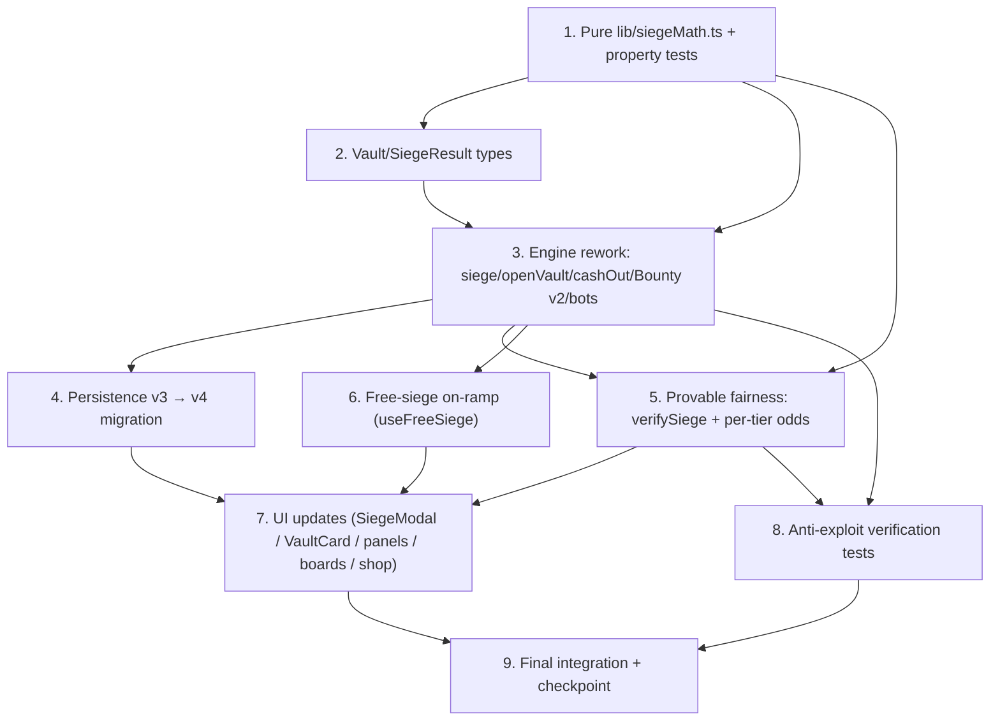

# Implementation Plan: Wallet Wars — "Siege the Vault" Economy

## Overview

This plan converts the **Siege the Vault** design into incremental, test-driven
coding steps for the client-side simulation (`src/lib/walletWarsState.ts`,
`ESCROW_ENABLED` stays `false`). The strategy is **pure-core-first**: build and
property-test the side-effect-free `lib/siegeMath.ts` module before touching the
stateful engine, then rework the engine on top of it, then migrate persistence,
provable fairness, the free-siege on-ramp, and finally the UI. Each step builds on
the previous one and the app remains compilable/runnable at every checkpoint.

**Implementation language:** TypeScript (existing React 19 + Vite 6 codebase; the
design specifies TypeScript interfaces). **Animation:** Framer Motion 12 only.
**No runtime dependency upgrades.** `fast-check` is added as a **dev-only**
dependency for the property tests (Requirement 25.3, 25.4).

All money-moving arithmetic must come from `siegeMath.ts` (Requirement 8.3); the
engine never computes payouts inline once the math module is wired.

## Task Dependency Graph

**Critical path:** 1 → 2 → 3 → {4, 5, 6} → 7 → 9, with 8 gating 9 in parallel.
Task 1 is foundational; nothing that moves SOL is wired until its math is proven.

## Tasks

- [x] 1. Build the pure money-math module `lib/siegeMath.ts`
  - [x] 1.1 Define tier params, configs, and breakdown types
    - Create `lib/siegeMath.ts` with `TierParams`, `StreakConfig`, `FeeBreakdown`, `PrizeBreakdown` interfaces
    - Add the four `TierParams` constants (pit/grind/arena/court) with exact published `feeRate`, `winChance`, `sliceRate`, `houseFeeCut`, `housePrizeRake` values from the Tier System table
    - Export `STREAK_CFG = { step: 0.04, cap: 25 }` (so `m ∈ [1.0, 2.0]`, satisfying `s·m_max ≤ 1`)
    - _Requirements: 7.1, 7.3, 7.4, 8.1, 8.2, 15.1_
  - [x] 1.2 Implement `tierParamsFor` and `feeMultiplierForStreak`
    - `tierParamsFor(amount)` returns the `TierParams` for `tierIndexForAmount(amount)` (re-export or import the existing mapping); total over all `amount ≥ 0`
    - `feeMultiplierForStreak(streak, cfg) = 1 + step·min(streak, cap)`
    - _Requirements: 7.2, 8.1, 8.2, 9.1, 9.3_
  - [x] 1.3 Implement `computeFee`, `computePrize`, `settleFailure`, `settleSuccess`
    - `computeFee` → `baseFee = f·V·mult`, `repeatTax = baseFee·repeatTaxMult`, `fee = baseFee + repeatTax`, `toDefenderOnFail = baseFee·(1−ρ_fee)`, `toHouseOnFail = baseFee·ρ_fee + repeatTax`
    - `computePrize` → `gross = s·V·mult` (clamped so `gross ≤ V`), `toRaider = gross·(1−ρ_prize)`, `toHouse = gross·ρ_prize`
    - `settleFailure` / `settleSuccess` return the per-actor deltas (raider/defender/house/corpus) used by the engine
    - _Requirements: 4.1, 4.2, 5.2, 5.3, 8.1, 8.2, 9.2, 18.3_
  - [x] 1.4 Implement `heatScore` and `evRaider` / `evDefender` / `evHouse`
    - `heatScore(v, now)` from `log10` size, capped streak fraction, and longevity decay (visibility only)
    - `evRaider = p·s·(1−ρ_prize) − f`; `evDefender = (1−ρ_fee)·f − p·s`; `evHouse = ρ_fee·f + p·ρ_prize·s`
    - _Requirements: 6.1, 6.2, 6.3, 8.2, 10.1_
  - [x]* 1.5 Add `fast-check` as a dev dependency and unit tests against the worked examples
    - Exact-value tests for the 20 SOL Court and 1 SOL Pit rows (fee, prize, splits, EVs)
    - _Requirements: 25.4, 6.1, 6.2, 6.3_
  - [x]* 1.6 Property test — Conservation / zero-sum (**Property 1**)
    - **Property 1: Conservation.** *For any* `V`, tier params, streak, repeat-tax, and roll, `Δraider + Δdefender + Δhouse + Δcorpus = 0`; also `toDefenderOnFail + toHouseOnFail = fee` and `toRaider + toHouse = gross`
    - **Validates: Requirements 5.1, 5.2, 5.3**
  - [x]* 1.7 Property test — EV sign invariants per tier (**Property 8**)
    - **Property 8: Sign guarantees.** *For all* four tier param sets, `evRaider < 0`, `evDefender ≥ 0`, `evHouse > 0`
    - **Validates: Requirements 6.4, 7.3, 7.4**
  - [x]* 1.8 Property test — Bounded raider downside (**Property 2**)
    - **Property 2: Bounded downside.** *For any* losing siege, raider loss `= fee` and `fee ≤ feeRate·V·m_max·(1+REPEAT_TAX_CAP)`
    - **Validates: Requirements 2.2, 3.5**
  - [x]* 1.9 Property test — Slice ≤ corpus + floor (**Property 3**)
    - **Property 3: Slice bound.** *For any* `V` and `m_k`, `prize.gross ≤ V`
    - **Validates: Requirements 4.2**
  - [x]* 1.10 Property test — Streak EV-ratio invariance + monotone multiplier (**Properties 7, 10**)
    - **Property 7: Streak EV-ratio invariance.** *For any* `k`, scaling `f` and `s` by `m_k` leaves `evRaider/fee` unchanged
    - **Property 10: Monotone multiplier.** `feeMultiplierForStreak` is non-decreasing and bounded by `[1, 1+step·cap]`
    - **Validates: Requirements 9.2, 9.3, 9.4**
  - [x]* 1.11 Property test — Collusion is −EV (**Property 5**)
    - **Property 5: Collusion −EV.** *For any* closed wallet group, summed internal EV `= −(ρ_fee·f + p·ρ_prize·s)·V < 0` per attempt
    - **Validates: Requirements 17.1**

- [x] 2. Introduce `Vault` and `SiegeResult` types
  - Rename `Stash` → `Vault` and add fields: `banked`, `survived`, `cracked`, `streak`, `openedAt`, `seq`, `compound`, `bountyPool`, `bountyExpiry`
  - Add `SiegeOutcome = "win" | "loss"` and the `SiegeResult` interface (`pWin`, `fee`, `repeatTax`, `seized`, `prizeGross`, `lost`, `roll`, `seed`, `streakAtSiege`, `targetWallet`, `targetId`, `yourVaultAfter`)
  - Add `REPEAT_TAX_*`, `STREAK`, and shield/cooldown config constants needed by later tasks to `WAR_CONFIG` (keep old fields temporarily so the app still compiles)
  - _Requirements: 1.2, 2.1, 4.1, 8.1_

- [ ] 3. Rework the engine in `walletWarsState.ts`
  - [ ] 3.1 Implement `openVault` and the targetable-board filter
    - Replace `openStash` with `openVault(amount)`: corpus = stake, mark `isYou`, init `banked/survived/cracked/streak/seq = 0`, `openedAt = now`, `compound = true`
    - Keep `OPEN_STAKES = [0.25, 1, 5, 20]`; exclude the player's own vault from the targetable list
    - _Requirements: 1.1, 1.2, 1.3, 1.4, 1.5_
  - [ ] 3.2 Implement `repeatTaxMult` and the `siege` precondition guards
    - `repeatTaxMult(targetId)` from `raidLog` timestamps within `REPEAT_WINDOW_MS`, bounded by `REPEAT_TAX_CAP`
    - `siege(targetId)` guards: cooldown, missing/shielded target, self-siege (`target.id === you.id` or `target.isYou`), tier mismatch, and unaffordable fee → return `null` with no state change
    - _Requirements: 2.3, 2.4, 2.5, 16.1, 16.2, 18.1, 20.2_
  - [ ] 3.3 Implement `siege` settlement using `siegeMath`
    - Draw seed, `roll = rollFromSeed(seed)`, `won = roll < params.winChance`; debit fee from raider
    - On loss: defender `+= toDefenderOnFail`, house `+= toHouseOnFail`, `survived++`, `streak++`
    - On win: corpus `−= prize.gross` (floor 0.01), raider `+= toRaider (+ bounty net)`, defender still banks toll, house `+= toHouse + ρ_fee·baseFee + repeatTax (+ bounty rake)`, `streak = 0`, `cracked++`
    - Always: route repeat-tax 100% to house, set `shieldUntil = now + SHIELD_MS`, `seq++`, `raidCooldownUntil = now + RAID_COOLDOWN_MS`; obtain every amount from `siegeMath`
    - _Requirements: 2.1, 2.2, 2.6, 3.1, 3.2, 3.3, 3.4, 3.5, 4.1, 4.3, 4.4, 4.5, 4.6, 4.7, 5.1, 8.3, 15.2, 18.2, 18.3, 20.1_
  - [ ] 3.4 Implement auto-compound, `cashOut`, and manual withdraw-banked
    - On every settled siege, if `compound`, fold `banked` into `amount` and reset `banked = 0`
    - `cashOut()` returns `amount + banked`, clears `you`, resets streak; add `withdrawBanked()` that harvests without growing corpus
    - _Requirements: 9.5, 11.1, 11.2_
  - [ ] 3.5 Implement Bounty v2 (`placeBounty` with pool/expiry/refund)
    - `placeBounty(targetId, amount)` adds to the target `bountyPool` with `bountyExpiry`, held separately from the placer's corpus (no tier movement)
    - On crack, add bounty net of `ρ_prize` to the prize and route bounty rake to house; in the tick, refund expired unclaimed bounties minus a small house fee
    - _Requirements: 21.1, 21.2, 21.3, 21.4_
  - [ ] 3.6 Update the bot simulation tick to siege semantics + heat sort
    - Bots pay a fee, defender banks on a bounce, corpus is sliced on a crack; sort the board by `heatScore` (hottest first); heat never alters odds
    - Remove `raid` and `FIXED_WIN_CHANCE`; update the `useWalletWars` return surface and adapt `WalletWarsScreen` wiring so the app still compiles
    - _Requirements: 10.2, 10.3, 25.1, 25.2_
  - [ ] 3.7 Confirm the on-chain seam stays dormant
    - Keep `ESCROW_ENABLED = false`; `siege` routes through `isEscrowLive()` (sim branch only) and moves no real funds
    - _Requirements: 24.1, 24.2, 24.3_
  - [ ]* 3.8 Integration test — conservation across a real siege settlement
    - Drive `openVault → siege(loss) → siege(win)` and assert the four balance deltas sum to zero and the corpus floor holds
    - **Validates: Requirements 5.1, 4.4, 19.4**

- [ ] 4. Migrate persistence from v3 to v4
  - Change `STORAGE_KEY` to `yoink_walletwars_v4`; on load, if a `yoink_walletwars_v3` record exists, map each `Stash → Vault` (`streak=0`, `seq=0`, `bountyExpiry=0`, `compound=true`, `openedAt=now`, `bountyPool` from prior bounty), preserving `you.amount`, `banked`, `totalBanked`, and `biggestHeist`
  - Fall back to the seeded `INITIAL` state on missing/invalid JSON; run in-memory without throwing when `localStorage` is unavailable
  - _Requirements: 23.1, 23.2, 23.3, 23.4, 23.5_
  - [ ]* 4.1 Unit test — v3→v4 migration and corrupt/absent-storage fallback
    - Seed a fake v3 blob, assert mapped `v4` shape and preserved balances; assert fallback paths do not throw
    - _Requirements: 23.1, 23.4, 23.5_

- [ ] 5. Provable fairness: `verifySiege` + variable per-tier odds
  - Keep `rollFromSeed` unchanged; resolve `won` iff `rollFromSeed(seed) < params.winChance`; keep `p` fixed within a tier (never varied by streak/heat/balance/size)
  - Include `seed`, `roll`, and `pWin` in every `SiegeResult`; implement `verifySiege(seed, pWin, claimedOutcome)` returning true iff the recomputed outcome matches
  - _Requirements: 22.1, 22.2, 22.3, 22.4, 22.5_
  - [ ]* 5.1 Property test — Verifiability round-trip (**Property 6**)
    - **Property 6: Verifiability.** *For any* result, `outcome === "win"` ⇔ `rollFromSeed(seed) < pWin`, and `verifySiege` agrees
    - **Validates: Requirements 22.2, 22.5**

- [ ] 6. Free-siege beginner on-ramp (`useFreeRound → useFreeSiege`)
  - Repurpose the hook to `useFreeSiege`: a claim waives the fee and targets a **house-owned training vault** (no real defender), paying any win from a capped house promo pool
  - Track a daily quota in `localStorage` (`yoink_ww_free_v1`), decrement on claim, reset on the UTC day boundary, and refuse to claim when the quota is zero; reuse the existing `computeFreeRound` cadence as a "free siege happy hour"
  - _Requirements: 14.1, 14.2, 14.3, 14.4, 14.5, 14.6_
  - [ ]* 6.1 Unit test — quota decrement, UTC reset, and zero-quota refusal
    - _Requirements: 14.4, 14.5, 14.6_

- [ ] 7. UI updates (Framer Motion only)
  - [ ] 7.1 `RaidModal → SiegeModal`
    - Show the attempt fee, published tier odds `p`, and prize slice; never fail silently (surface cooldown/shield/tier/affordability blocks); reveal `seed`, `roll`, and the `roll < p` comparison with an honest provably-fair badge
    - _Requirements: 2.1, 22.4, 22.6_
  - [ ] 7.2 `StashCard → VaultCard`
    - Render a heat badge (`HOT`/`ON FIRE`), a live shield countdown, and the published per-tier odds
    - _Requirements: 10.2, 20.1, 22.3_
  - [ ] 7.3 `YourStashPanel → YourVaultPanel`
    - Banked-fee ticker, survival streak, auto-compound toggle, manual withdraw-banked, and cash-out
    - _Requirements: 11.1, 11.2, 9.5_
  - [ ] 7.4 WarFeed + leaderboards + shop cosmetics
    - Emit siege events (bounce/crack) in `WarFeed`; add fees-farmed, longest-vault, biggest-vault, and biggest-heist boards scoped to seasons with reset support; surface status cosmetics in `ShopScreen` as visual-only
    - _Requirements: 12.1, 12.2, 12.3, 12.4, 12.5, 13.1, 13.2_

- [ ] 8. Checkpoint — Ensure all tests pass
  - Ensure all tests pass, ask the user if questions arise.

- [ ] 9. Anti-exploit verification tests
  - [ ]* 9.1 Self-siege block (**Property 4**)
    - **Property 4: No self-siege.** *For any* state, `siege(id)` returns `null` when the target `isYou` or `id === you.id`, with no state change
    - **Validates: Requirements 16.1, 16.2**
  - [ ]* 9.2 Shield safety + concurrency guard (**Property 9**)
    - **Property 9: Shield safety.** *For any* state, a vault with `now < shieldUntil` cannot be sieged; prize is computed from corpus read at settle time and `seq` increments each settle; corpus never drops below the 0.01 floor
    - **Validates: Requirements 19.1, 19.2, 19.3, 19.4, 20.2**
  - [ ]* 9.3 Repeat-tax routing test
    - Assert escalating repeat-tax within `REPEAT_WINDOW_MS` is bounded by the cap and routed 100% to the house, with the defender's banked share derived from `baseFee` only
    - _Requirements: 18.1, 18.2, 18.3_

- [ ] 10. Final checkpoint — integration and wiring
  - Run the full open → many sieges → crack → shield → cash-out flow; assert the persisted `v4` shape, leaderboard updates, and that self-siege is always refused; confirm no runtime dependencies were added/upgraded
  - Ensure all tests pass, ask the user if questions arise.
  - _Requirements: 25.3, 24.1_

## Notes

- Tasks marked with `*` are optional test sub-tasks and can be skipped for a faster
  MVP; core implementation tasks are never optional.
- Property test sub-tasks each reference a numbered **Correctness Property** from
  the design and the requirement clauses they validate; run each with a minimum of
  100 iterations and tag with `Feature: wallet-wars-siege-economy, Property N`.
- All SOL-moving amounts must come from `lib/siegeMath.ts` (Requirement 8.3); the
  engine performs no inline payout arithmetic once Task 3 is complete.
- `ESCROW_ENABLED` stays `false` and the on-chain escrow / VRF program, plus The Bag
  game, are out of scope.
