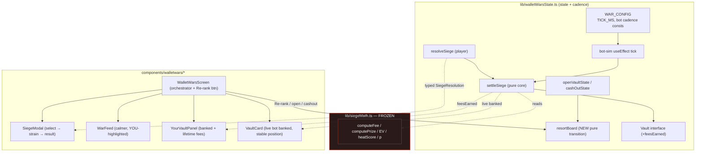
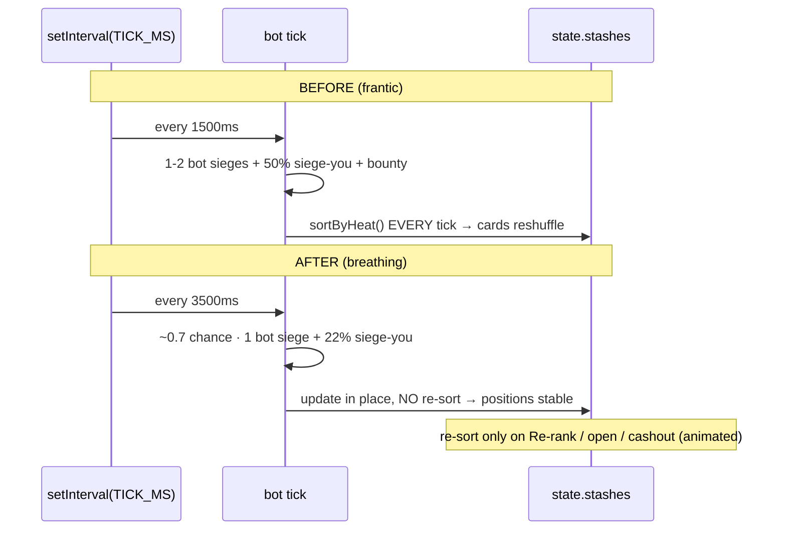
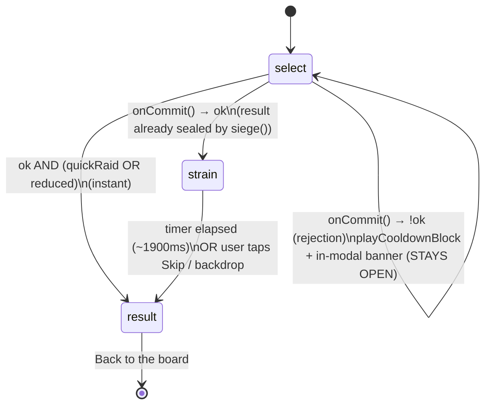
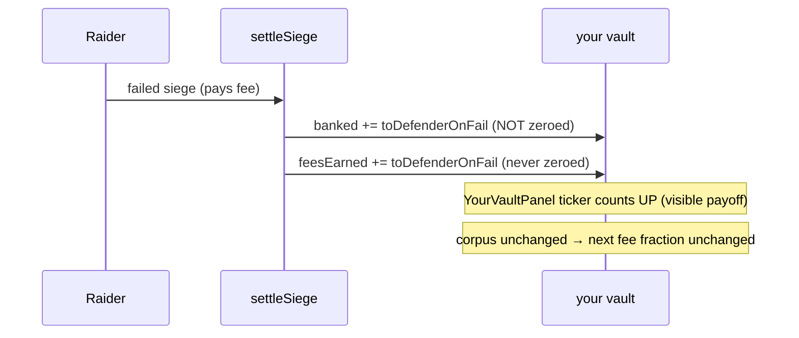

# Design Document: Wallet Wars — "Siege the Vault" Feel Pass

## Overview

This feature is a **pacing + feedback/UX refinement** of the existing Wallet Wars
"Siege the Vault" experience. It changes nothing about the economy: `siegeMath.ts`
(tier params, EV, fee/prize formulas) and the provable-fairness rule
(`win ⇔ rollFromSeed(seed) < p_vault`) are **untouched**. `ESCROW_ENABLED` stays
`false`. The Bag (`bag-reign-toll`) is not touched. All motion is Framer Motion
using transform/opacity only and honours `prefers-reduced-motion`.

Three user-reported problems are solved:

1. **Pacing** — the board moves too fast: bots siege every `1500ms` AND the visible
   board re-sorts by heat **every tick**, so cards shuffle while being read; depleted
   vaults are replaced instantly. Fix: slow the ambient cadence and **settle the board
   order** (sort only on mount / explicit refresh / when the player opens-or-changes
   their vault), keeping card positions stable between those moments and animating any
   rare reorder smoothly via Framer `layout`.
2. **The siege moment** — sieges resolve with no tension arc. Fix: a deliberate,
   **skippable** `strain` build-up (~1.9s: the vault lock straining/cracking) before the
   reveal, slotting into the `SiegeModal` phase machine, revealing the seed/roll/`roll<p`,
   instant under reduced motion, with rejections still surfaced immediately (no fake
   build-up on a declined siege).
3. **Feedback legibility** —
   - (a) "Fees banked still shows 0" because `openVaultState` defaults `compound:true`
     and `settleSiege` sweeps `banked → amount` (banked := 0) on every settle. Fix:
     **default auto-compound OFF** so banked visibly accumulates, **and** add a
     persistent lifetime `feesEarned` counter that is never zeroed by compounding/withdraw,
     and make bot vault banked read live.
   - (b) "Hard to tell who won/lost" — Fix: an unmistakable WIN (celebratory crack) vs
     survivable LOSS ("Bounced — you only lost the fee") in the modal, plus a clearer
     WarFeed (distinct crack vs bounce styling, calmer cadence, and YOU-involved events
     visually highlighted).

### Design level

This is a combined **High-Level (UX/pacing rationale)** + **Low-Level (exact constants,
state/UI changes, function touch-points)** design, in TypeScript (the repo: React 19 +
Vite 6 + TS 5.7 + Tailwind 4 + Framer Motion 12).

### Guiding invariant (repeated throughout)

> Nothing in `src/lib/siegeMath.ts` changes. No fee rate, win chance, slice rate, house
> cut, EV function, streak ramp, or the `roll < p` win rule is altered. Every change here
> is about **cadence, board stability, when the player's own banked folds, and what is
> surfaced** — never the money math.

---

## Architecture



**Frozen (red):** `siegeMath.ts`. **Changed:** `walletWarsState.ts` (config + Vault field +
two settle/transition touch-points + the tick), and five components.

---

## Problem 1 — Pacing & Board Stability

### 1.1 High-level rationale

The board feels frantic for two compounding reasons:

- **Ambient cadence is too dense.** The tick fires every `1500ms` and runs `1–2` bot
  sieges plus a `50%` chance a bot sieges *you*, plus occasional bounty seeding — so
  multiple visible state changes land every 1.5s.
- **The board re-sorts every tick.** `sortByHeat(...)` is called at the end of **every**
  tick (and inside `resolveSiege`), so cards physically reorder while the player is
  reading them. Combined with `VaultCard`'s `layout` prop and `<AnimatePresence mode="popLayout">`,
  every re-sort triggers a layout animation — the "cards jump/shuffle" complaint.

The fix is two-pronged: **slow the cadence** so the board breathes, and **settle the
order** so cards hold position and only move on intentional, infrequent moments (which then
animate smoothly *because* they are rare).

### 1.2 Low-level: proposed constants

In `WAR_CONFIG` (`src/lib/walletWarsState.ts`):

| Constant | Current | Proposed | Rationale |
|---|---|---|---|
| `TICK_MS` | `1_500` | `3_500` | ~2.3× slower ambient cadence; board + feed breathe. Still alive. |
| `RAID_COOLDOWN_MS` | `3_000` | `3_000` (unchanged) | Player agency — don't over-throttle the player's own action. |
| `SHIELD_MS` | `6_000` | `6_000` (unchanged) | Economy-adjacent; leave as-is. |

New tuning constants (cadence only — they gate *how often* a sim siege happens, never
*odds* or *amounts*):

```typescript
// Ambient bot cadence (feel only — never affects odds or payouts).
BOT_SIEGES_PER_TICK: 1,        // was effectively 1–2 (1 + coinflip)
BOT_TICK_ACTIVITY: 0.7,        // probability a given tick runs any ambient siege
BOT_SIEGE_YOU_CHANCE: 0.22,    // was 0.5 — being raided is a notable beat, not constant
```

> These constants only change the **frequency** of simulated events. Each event that *does*
> occur is still settled by the unchanged `settleSiege`/`siegeMath` path, so EV and odds are
> identical per event.

### 1.3 Low-level: board-stability approach

The board renders `state.stashes` in array order (filtered per tier). Today the array is
re-sorted by heat every tick. The fix keeps the array in a **stable order** and recomputes
the heat ranking only at explicit moments.

**Touch-points:**

1. **Bot tick (`useWalletWars` `useEffect`)** — remove the trailing
   `stashes = sortByHeat(stashes, ts);`. Vault updates (`map`) and depleted-vault
   replacement (`makeBotVault`) already happen **in place at the same index**, so dropping
   the re-sort keeps every card's position fixed between ranking moments.
2. **`resolveSiege` (player siege)** — change `stashes: sortByHeat(newStashes, ctx.at)` to
   `stashes: newStashes`. The sieged target updates in place; the board does not reshuffle
   when the player acts.
3. **New pure transition `resortBoard(state, at)`** — returns `{ ...state, stashes:
   sortByHeat(state.stashes, at) }`. Exposed on the hook as `resortBoard()`.
4. **Explicit ranking moments** that call `resortBoard` (or seed sorted):
   - On mount (`seedBoard` already sorts once — unchanged).
   - On **user refresh** — a new "Re-rank board" affordance in the TARGET CARDS header in
     `WalletWarsScreen`.
   - When the player **opens** a vault (`openVaultState`) or **cashes out / re-ups**
     (`cashOutState`) — fold a `sortByHeat` into those transitions so a fresh ranking is
     presented exactly when the player's focus changes.
5. **Smooth, infrequent motion** — `VaultCard` keeps its `layout` prop and the list keeps
   `<AnimatePresence mode="popLayout">`. Because reorders now happen only at the moments
   above, the Framer `layout` transition animates a calm, legible repositioning instead of
   a per-tick shuffle. No new animation code is required; reduced motion already neutralises
   `VaultCard`'s entrance via `usePrefersReducedMotion`.

> Heat is **visibility-only** (per the `heatScore` contract in `siegeMath.ts`) — settling the
> order changes nothing about odds or payouts. Heat *badges* on each card still update live
> (computed from a live `now` inside `VaultCard`); only the **array order** is settled.

### 1.4 Cadence: before vs after



---

## Problem 2 — The Siege Moment (tension arc)

### 2.1 High-level rationale

A siege should have a **build → breach → reveal** arc: the player commits, the vault lock
visibly *strains and cracks*, then the outcome lands. Today `SiegeModal` goes
`select → pick → result`, where `pick` is a 3-vault guessing mini-game that is also
*skipped entirely* when `Quick Siege` is on (sticky in localStorage), so many sessions jump
straight to an instant result — the dopamine beat is skipped.

**Decision:** repurpose the optional `pick` ceremony into a single, on-theme **`strain`**
build-up phase. Stacking a guessing game *and* a build-up would make pacing worse; one
focused strain arc is the canonical tension beat and matches the "siege the vault" fiction
(the lock cracking IS the ceremony). `Quick Siege` is repurposed from "skip the vault pick"
to "skip the build-up".

### 2.2 Low-level: phase machine

`SiegeModal` phase type changes from `"select" | "pick" | "result"` to
`"select" | "strain" | "result"`. The `picked`/`loaded` state and `pickVault` handler are
removed; `quickRaid`/`QR_KEY` semantics shift to "skip build-up".



Key ordering guarantee: `onCommit()` (→ `siege()` → `resolveSiege`) computes the
provably-fair result **before** any build-up plays. The `strain` phase is pure ceremony
over an **already-sealed** roll — it never re-rolls and cannot change the outcome.

### 2.3 Low-level: `strain` sequence (timings)

Default total ≈ **1900ms** (within the 1.5–2.5s target), three Framer keyframe sub-beats on
a single lock element (transform/opacity only):

| Sub-beat | Window | Motion (transform/opacity) | Audio |
|---|---|---|---|
| Pressure | 0–700ms | lock `scale` 1→1.06, jitter `x/y` ≤ ±2px | low `playTick` |
| Cracking | 700–1500ms | hairline crack overlay `opacity` 0→1, jitter ≤ ±6px, `rotate` ±2° | accelerating `playTick` |
| Breach | 1500–1900ms | held freeze (anticipation), crack overlay full | silence → resolve |

- **Seed reveal in the beat:** a scrambling `roll`/`seed` readout animates during Pressure/
  Cracking and **locks to the real `result.roll` / `result.seed`** at the Breach point, so
  the provable-fair values are revealed inside the arc (not just after). The final
  `roll <|≥ p → CRACK|HELD` comparison persists into `result`.
- **Skippable:** a persistent `Skip ▸` button and tap-on-backdrop clear the timer
  (`clearTimeout`) and jump straight to `result` (same sealed outcome).
- **Reduced motion:** when `usePrefersReducedMotion()` is true, `strain` is bypassed — set
  `phase = "result"` immediately with no jitter/shake/scramble (instant outcome). Also the
  path taken when `quickRaid` is on.
- **Win vs loss exit of strain:**
  - WIN → lock **shatters**: the existing `CrackBurst` shard ring fires + "CRACKED!".
  - LOSS → lock **holds/clangs shut**: lock icon snaps closed (scale 1.1→1, no shards) →
    "Bounced — you only lost the fee."

### 2.4 No-silent-failure preservation

The rejection path is unchanged in spirit: in `select`, `commit()` calls `onCommit()`; if
`!res.ok` it calls `playCooldownBlock()`, sets the `blocked` banner, and **stays in
`select`**. A declined siege (cooldown / shielded / self / tier-mismatch / insufficient
funds) **never enters `strain`** — no fake build-up on a rejection. The parent
(`WalletWarsScreen.handleSiegeCommit`) still mirrors the typed reason into the StatusBar.

---

## Problem 3 — Feedback Legibility

### 3.1a Banked-display fix

**Root cause (confirmed in code):**
`openVaultState` creates the player vault with `compound: true`. On every settled siege,
`settleSiege` runs:

```typescript
if (defender.compound) {
  defenderCorpus = defenderCorpus + defenderBanked; // fold banked → corpus
  defenderBanked = 0;                               // ...then zero banked
}
```

So the toll the player just banked (`defender.banked + feeB.toDefenderOnFail`) is swept to
`0` in the same settlement — the banked ticker in `YourVaultPanel` never visibly grows.
`makeBotVault` has the same `compound: true`, so bot-card banked also collapses to ~0 after
their first siege.

**Chosen approach (both, minimal and economics-safe):**

1. **Default auto-compound OFF.** `openVaultState` → `compound: false`; `makeBotVault` →
   `compound: false`. Banked now *accumulates visibly* and the player opts INTO compounding
   via the existing `YourVaultPanel` toggle (unchanged mechanism). Bot card banked reads
   live.
2. **Persistent lifetime counter `feesEarned`.** Add `feesEarned: number` to `Vault`.
   `settleSiege` increments it by `feeB.toDefenderOnFail` on **every** settled siege
   (defender keeps the toll on win *and* loss), **independent of `compound`**. It is never
   zeroed by compounding or by `withdrawBankedState`. `YourVaultPanel` surfaces it as
   "Lifetime fees earned" so the survive-and-earn payoff is **always** visible even if a
   player later turns compounding on.

**Why this does NOT change economics:**

- `feesEarned` moves **no SOL** — it is a display-only accumulator. It is excluded from
  `cashOutState` (which still returns `corpus + banked`), so there is no double-counting.
- Compounding remains a player choice that relocates the player's **own** banked into their
  **own** corpus (intra-actor); flipping only the *default* changes neither any rate nor the
  `roll < p` rule. All `siegeMath` fractions (fee/slice/EV) are computed against the corpus
  exactly as before. Conservation (`raider + defender + house + corpus === 0`) is preserved
  because the fold logic itself is unchanged.
- The instantaneous "what the player owns" (`corpus + banked`) at settle time is identical
  whether compounding is on or off; the default flip only changes **when** banked relocates
  and therefore **what is surfaced**.

**Banked flow (compound OFF — the new default):**



**Touch-points for 3.1a:**

| File / function | Change |
|---|---|
| `walletWarsState.ts` · `Vault` interface | add `feesEarned: number` |
| `walletWarsState.ts` · `settleSiege` | `feesEarnedAfter = defender.feesEarned + feeB.toDefenderOnFail`; set on `newDefender`. Compound fold logic unchanged. |
| `walletWarsState.ts` · `openVaultState` | `compound: false`, `feesEarned: 0` |
| `walletWarsState.ts` · `makeBotVault` | `compound: false`, seed `feesEarned` from the existing seeded banked value |
| `walletWarsState.ts` · `normalizeVault` | default `feesEarned` (fallback `banked` if absent, else `0`) |
| `walletWarsState.ts` · `migrateV3ToV4` | carry/seed `feesEarned`; legacy `compound` may stay as stored |
| `YourVaultPanel.tsx` | add "Lifetime fees earned" stat (`you.feesEarned`); banked ticker now grows by default; toggle copy reflects default-off |
| `VaultCard.tsx` | bot banked now reads live (no code change needed beyond compound default) |

### 3.1b Win/Loss + WarFeed legibility

**SiegeModal result (enhance existing):**
- **WIN:** keep gold "CRACKED!", `+seized` headline, `CrackBurst` shard ring, "Share this
  heist". The lock-shatter is the strain→result transition (2.3).
- **LOSS:** keep "Bounced" but make survivability unmistakable — a reassuring emerald line
  "Vault held · you only lost the fee" with the `−lost` shown smaller, plus the existing
  "Re-up and go again" framing. Lock holds/clangs (no shards).
- Both keep the provably-fair reveal row (`roll <|≥ p → CRACK|HELD` + `seed`).

**WarFeed (calmer + YOU-highlighted):**
- **Distinct styling:** crack/win = orange/gold accent + "cracked"; bounce/loss = emerald
  "+toll" + "defended"; refund = phantom/purple "↩". (Mostly present — keep & sharpen.)
- **Highlight YOU:** events where `raiderIsYou || targetIsYou` get a stronger treatment —
  a left accent bar (gold for you-raided, blood when you-were-cracked), a small "YOU" chip,
  and a slightly stronger background than today's subtle gold tint, so the player can always
  pick out what happened to them.
- **Calmer cadence:** driven by `TICK_MS 3500` + `BOT_SIEGES_PER_TICK 1`; the feed keeps its
  in-place `<AnimatePresence>` and 40-event cap. Win entrance keeps the celebratory pop;
  bounces slide in calmly (already implemented). Reduced motion neutralises entrances.

---

## Components and Interfaces

### `Vault` (extended)

```typescript
export interface Vault {
  // ...all existing fields unchanged...
  compound: boolean;     // DEFAULT now false (open + bot); player opts in via toggle
  /** NEW: lifetime tolls banked, monotonic; never zeroed by compound/withdraw. Display only. */
  feesEarned: number;
}
```

### New engine surface

```typescript
/** Pure: re-rank the visible board by heat at `at`. Permutation only — no vault mutated. */
export function resortBoard(state: WarState, at: number): WarState;

// Hook return adds:
//   resortBoard: () => void
```

### `SiegeModal` (phase machine)

```typescript
type Phase = "select" | "strain" | "result"; // was "select" | "pick" | "result"
// quickRaid: now "skip build-up" (was "skip vault pick")
// New: <StrainSequence result={result} reduced={reduced} onDone={() => setPhase("result")} />
//   - schedules a ~1900ms timer (0ms under reduced/quickRaid), Skip button + backdrop tap clear it
```

### `WalletWarsScreen` (orchestrator)

- Adds a "Re-rank board" button in the TARGET CARDS header → `resortBoard()`.
- Wires `resortBoard()` (or relies on the open/cashout transitions doing it) on open/cashout.

---

## Data Models

No new persisted economic fields beyond the display-only `feesEarned`. Persistence schema
key stays `yoink_walletwars_v4`; `feesEarned` is added to `normalizeVault`/`migrateV3ToV4`
with safe defaults (`fin(v.feesEarned, Math.max(0, banked))`), so malformed/legacy saves
never `NaN` the UI and never affect money math.

---

## Correctness Properties

*A property is a characteristic that should hold across all valid executions. These bridge
the spec to machine-verifiable guarantees. Requirement references are added during the
requirements phase.*

### Property 1: Money math is byte-for-byte unchanged
For all `corpus > 0`, `profile`, `streak`, and `repeatTaxMult ≥ 0`, the outputs of
`computeFee`, `computePrize`, `evRaider/Defender/House`, `vaultParamsFor`, and `heatScore`
are identical before and after this feature (regression equality).

### Property 2: Provable fairness preserved
For all `seed` and tier params, `verifySiege(seed, p, outcome)` holds and a siege is a win
iff `rollFromSeed(seed) < p_vault`; the `strain` build-up never alters the sealed outcome.

### Property 3: Conservation holds
For all settled sieges, `raider + defender + house + corpusΔ === 0` (the `settleSuccess`/
`settleFailure` zero-sum), unchanged by the addition of `feesEarned`.

### Property 4: `feesEarned` is a monotonic, display-only accumulator
For any sequence of settled sieges against a vault, `feesEarned` is non-decreasing, equals
the cumulative sum of `toDefenderOnFail` over those sieges, and is **never** decreased by
auto-compounding or by `withdrawBankedState`.

### Property 5: Cash-out excludes `feesEarned`
For all states with an open vault, `cashOutState` returns exactly `corpus + banked`,
independent of `feesEarned` and of the `compound` flag (no double-counting).

### Property 6: Compound default off → banked visibly accumulates
For all settled sieges where the defender's `compound === false`, banked increases by
exactly `toDefenderOnFail` and corpus is unchanged by the fold; where `compound === true`,
banked folds to `0` and corpus grows by the prior banked — and both branches preserve
Property 3.

### Property 7: Board resort is a non-mutating permutation
For all states and `at`, `resortBoard` produces a stash array that is a permutation of the
input (same multiset of vault ids; no vault created, destroyed, or economically mutated).

### Property 8: Board order is stable between ranking moments
For all bot ticks and player sieges that do not invoke a ranking moment (mount / Re-rank /
open / cashout), the **relative order** of surviving (non-replaced) vault ids is unchanged;
in-place replacement keeps a replaced vault at its prior index.

### Property 9: No build-up on a rejected siege
For all rejection reasons (`cooldown | shielded | self_siege | tier_mismatch |
insufficient_funds`), the modal stays in `select`, surfaces the typed reason, and never
enters `strain`.

### Property 10: Reduced motion yields the instant outcome
For all sealed results, when reduced motion is preferred the modal transitions directly to
`result` with the same outcome and no build-up animation.

---

## Error Handling

- **Rejected siege:** typed `SiegeRejection` surfaces in-modal (banner) + StatusBar; modal
  stays open; no `strain`. (Unchanged behaviour, preserved.)
- **Bad sim tick:** the tick's existing `try/catch` (logs + skips) is retained so a single
  bad tick never crashes the tab.
- **Skip during strain:** clears the pending timer; safe even if tapped repeatedly (idempotent
  transition to `result`).
- **Corrupt/legacy save:** `normalizeVault`/`migrateV3ToV4` default `feesEarned` safely;
  unavailable `localStorage` → in-memory session (unchanged).

---

## Testing Strategy

### Property-based tests (engine, pure — no DOM)
Run ≥100 iterations each (e.g. `fast-check`), tagged to the design properties:
- **Economics frozen (P1):** snapshot/equality of `siegeMath` outputs over random
  `(corpus, profile, streak, tax)` — must equal a frozen baseline.
- **Fairness (P2):** random seeds → `verifySiege` and `win ⇔ roll < p`.
- **Conservation (P3):** random settled sieges → sum of deltas `=== 0` (within float epsilon).
- **`feesEarned` accumulator (P4):** random siege sequences → monotonic, equals Σ
  `toDefenderOnFail`, unaffected by `setCompoundState`/`withdrawBankedState`.
- **Cash-out (P5):** random states → `cashOutState === corpus + banked`.
- **Compound branches (P6):** random sieges with `compound` true/false → banked/corpus
  relations hold and conservation preserved.
- **Resort permutation (P7) + stability (P8):** random boards → `resortBoard` is a
  permutation; random ticks without a ranking moment preserve relative id order.

### Example / edge tests
- Reduced motion (P10): `usePrefersReducedMotion` → `strain` skipped, instant result.
- Rejection (P9): each `SiegeRejection.kind` keeps the modal in `select`, no `strain`.
- Skip mid-strain → reveals the pre-sealed outcome unchanged.

### Integration / UI (1–3 representative examples, not PBT)
- WarFeed renders YOU-involved events with the highlight treatment and distinct crack vs
  bounce styling.
- `YourVaultPanel` banked ticker counts up after a bounced raid (compound off default);
  "Lifetime fees earned" reflects `feesEarned`.
- `vite build` succeeds; board cards hold position across ticks and animate on Re-rank.

---

## Out of Scope

Real Solana escrow/VRF, any economy/odds/EV change, `siegeMath` edits, and The Bag
(`bag-reign-toll`). `ESCROW_ENABLED` remains `false`.
